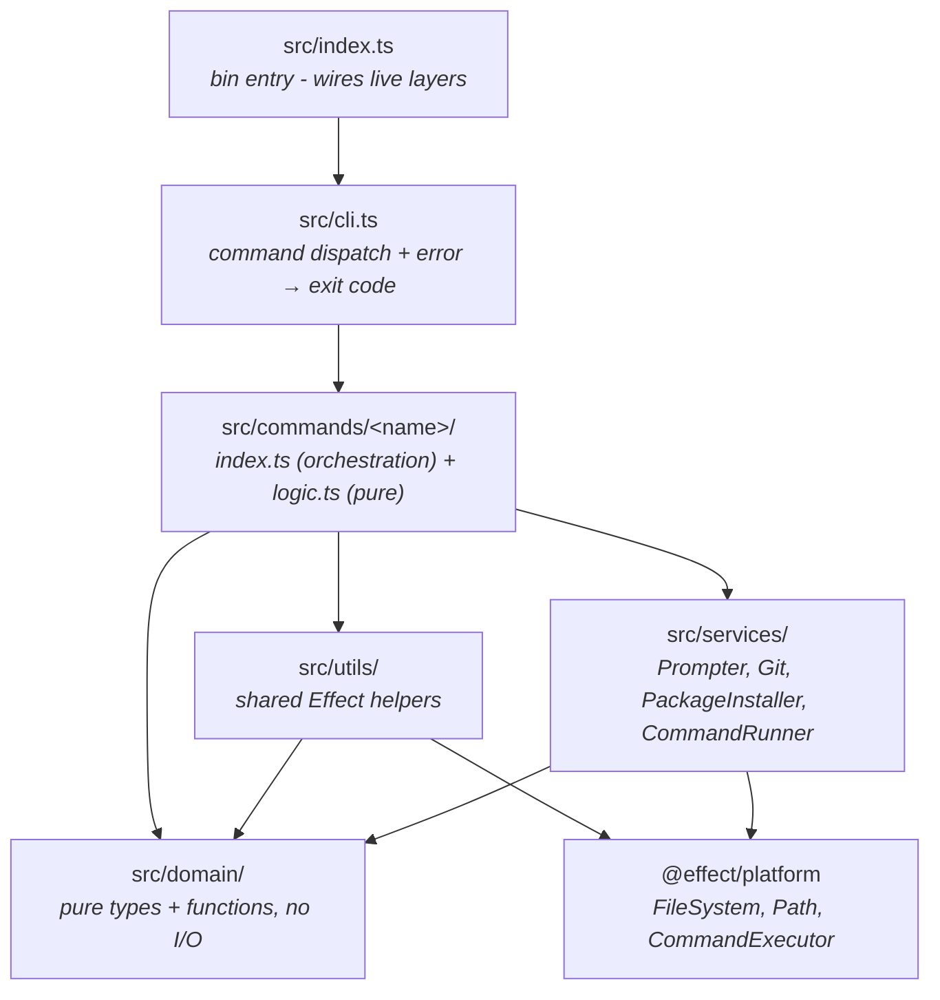
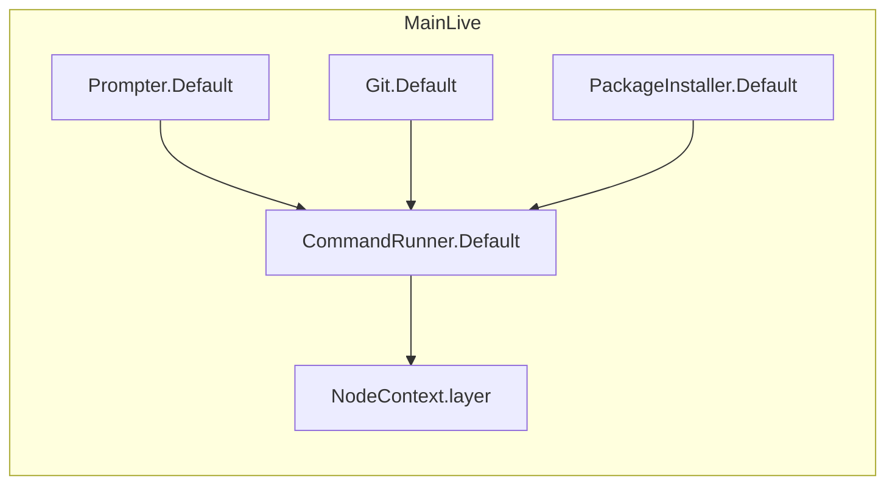
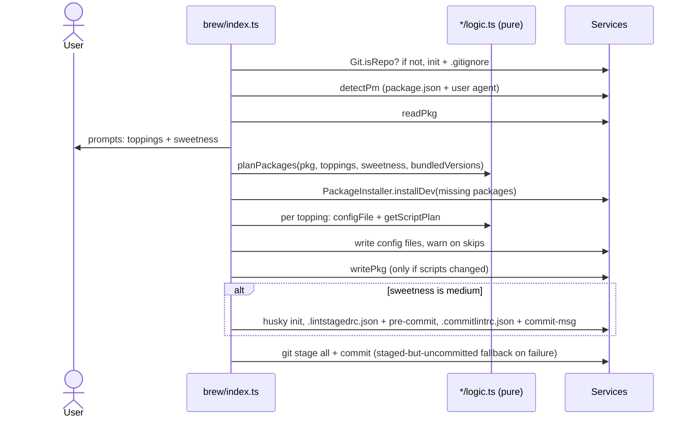

# Architecture

This document explains how `@chanom/cli` is structured, aimed at someone seeing the codebase (and possibly [Effect](https://effect.website)) for the first time.

## The big picture

The CLI is built on **Effect**, a TypeScript library for writing programs as composable, testable values. The core idea driving the whole structure:

> **Code that decides** (pure logic) is separated from **code that does** (I/O), and all I/O goes through swappable services.

That gives us a layered architecture where each layer only talks to the layers below it:



The golden rule: **`domain/` and every `logic.ts` are pure** - plain functions, no file system, no processes, no prompts. Everything with a side effect lives in a service or goes through `FileSystem`/`Path` from `@effect/platform`.

## A 2-minute Effect primer

You only need three concepts to read this codebase:

**1. An `Effect` is a description of a program, not the program running.** `Effect<A, E, R>` means: when run, it produces a value `A`, may fail with error `E`, and needs the services `R` to run. Nothing happens until the runtime executes it.

**2. `Effect.gen` is async/await for Effects.** `yield*` awaits an effect:

```ts
const program = Effect.gen(function* () {
  const prompter = yield* Prompter; // ask for a service
  const answer = yield* prompter.select({ ... }); // run an effect, get its value
});
```

**3. Services are injected, not imported.** A service like `Git` is a class describing capabilities (`init`, `commit`, ...). Code asks for it with `yield* Git`, and the actual implementation (a **layer**) is provided at the very edge of the app - the real one in `src/index.ts`, stubs in tests. This is why every command is testable without touching a real terminal, file system, or git.

Errors are **tagged errors** (`Data.TaggedError`), e.g. `PkgNotFound`, `InstallFailed`. They travel in the `E` channel of the effect type - no `throw`/`try` - and are handled by tag in one place (`src/cli.ts`).

## Layer by layer

### `src/domain/` - pure decisions

Plain data types and functions. No Effect, no I/O, trivially unit-testable.

| File                 | What it decides                                                                                                      |
| -------------------- | -------------------------------------------------------------------------------------------------------------------- |
| `pkg.ts`             | The `Pkg` shape (parsed package.json), ESM detection, "is this package installed / at the pinned version?"           |
| `scripts.ts`         | `planScripts` - merge wanted scripts into existing ones without overwriting, reporting what was added vs skipped     |
| `package-manager.ts` | Resolving the package manager from hints (`packageManager` field > user agent > fallback), how each PM runs a binary |
| `setup.ts`           | Which file names count as an existing config for each tool (e.g. all the `oxlint.config.*` variants)                 |
| `versions.ts`        | The `ToolVersions` shape - pinned versions the generated configs are known to work with                              |

### `src/services/` - capabilities with side effects

Each is an `Effect.Service` class with a `.Default` live layer. Commands never call `child_process`, `@clack/prompts`, or git directly - they go through these:

| Service            | Responsibility                                                                                                                                        |
| ------------------ | ----------------------------------------------------------------------------------------------------------------------------------------------------- |
| `CommandRunner`    | Low-level process spawning. Three modes: `capture` (collect output), `exitCode`, `execInherit` (stream to the user's terminal)                        |
| `Git`              | Git operations built on `CommandRunner` (init, stage, commit, identity checks) plus `.gitignore` writing                                              |
| `PackageInstaller` | `pnpm/npm/yarn/bun add -D ...`, failing with `InstallFailed` on a non-zero exit                                                                       |
| `Prompter`         | All terminal interaction (intro/outro, select, multiselect, spinners, warnings) wrapping `@clack/prompts`. Cancelling a prompt fails with `Cancelled` |

`Git` and `PackageInstaller` depend on `CommandRunner`, so stubbing one `CommandRunner` in tests stubs everything that shells out.

### `src/utils/` - shared effectful helpers

Small helpers used by multiple commands, built on `FileSystem`/`Path`:

- `pkg-file.ts` - `readPkg` / `writePkg` (fails with `PkgNotFound` / `PkgInvalid`)
- `detect-pm.ts` - reads `package.json` and resolves the package manager via the domain function
- `detect-setup.ts` - finds an existing config file for a tool from the domain's candidate lists

### `src/commands/<name>/` - one folder per command

Every command folder has the same split:

- **`logic.ts` - pure.** Decides _what_ to do: which packages are missing (`getPackages`), what the config file should contain (`configFile`), which scripts to add (`getScriptPlan`). Takes plain data in, returns plain data out.
- **`index.ts` - effectful.** Does it: checks for existing config, writes files, warns via `Prompter`. The convention is an `apply` function that **returns an updated `Pkg` instead of mutating** - the caller decides when to write `package.json`.

`brew` is the only user-facing command; the `add-*` folders are its building blocks:

```
commands/
├── brew/            orchestrates everything below
├── add-oxlint/      oxlint.config.* + lint scripts
├── add-oxfmt/       oxfmt.config.* + format scripts
├── add-knip/        knip.config.* + knip script
├── add-husky/       husky init
├── add-lint-staged/ .lintstagedrc.json + pre-commit hook
└── add-commitlint/  .commitlintrc.json + commit-msg hook
```

### `src/cli.ts` - dispatch and error mapping

Looks up the command by name and converts every tagged error into a user-facing message and an exit code. This is the **only** place errors become exit codes:

- success and `Cancelled` (user hit Ctrl+C) → exit `0`
- `UnknownCommand`, `PkgNotFound`, `PkgInvalid`, `InstallFailed`, `HuskyInitFailed`, anything unexpected → friendly message via `Prompter.error`, exit `1`

### `src/index.ts` - the bin entry

The only file that knows about the real world. It builds `MainLive` by merging the live service layers on top of `NodeContext.layer` (which provides the real `FileSystem`, `Path`, and `CommandExecutor`), runs the program, and sets `process.exitCode`.



## What happens when you run `chanom brew`



Note the rhythm in the middle: **plan (pure) → apply (effectful)**. `planPackages` computes the install list from plain data; each topping's `apply` computes its script plan purely, then performs the writes. This is the pattern to follow for new features.

### Pinned versions

`src/bundled-versions.ts` reads globals like `__OXLINT_VERSION__` that don't exist in the source - they're injected at build time by `tsdown` (from the pnpm workspace catalog and the local `@chanom/dev-config` version; see `tsdown.config.ts`) and by `vitest.config.ts` for tests. This is how a published CLI knows which tool versions its generated configs support.

## Testing

Tests live in `test/`, mirroring `src/` one-to-one, using vitest + `@effect/vitest` (`it.effect` runs an Effect as a test). Because all I/O goes through services, tests provide stub layers from `test/support/` instead of the real world:

| Stub               | Replaces              | How                                                                 |
| ------------------ | --------------------- | ------------------------------------------------------------------- |
| `makeTestFs`       | `FileSystem` + `Path` | In-memory `Map` of path → contents; assert on the map after running |
| `makeTestPrompter` | `Prompter`            | Scripted prompt answers; captures warnings/errors for assertions    |
| `makeTestRunner`   | `CommandRunner`       | Canned exit codes/output per command; records every invocation      |
| `makeTestEnv`      | everything            | Bundles the above into one layer for command-level tests            |

A typical command test: build a test env with some initial files, run `apply` or `brew` against it, then assert on the in-memory files, the recorded commands, and the returned `Pkg`.

**Convention: new code in a layer gets a matching test.** Pure logic gets plain unit tests; effectful code gets `it.effect` tests with stub layers.

## Adding a new topping (checklist)

Say you're adding a `biome` topping:

1. `src/commands/add-biome/logic.ts` - pure `getPackages`, `configFile`, `getScriptPlan`.
2. `src/commands/add-biome/index.ts` - `apply(cwd, esm, pkg)` that checks `detectSetupFile`, writes the config, and returns the updated `Pkg`.
3. `src/domain/setup.ts` - add the config file candidates so existing setups are detected.
4. Wire into `brew`: the prompt option in `askRecipe`, `planPackages` in `brew/logic.ts`, and `applyToppings` in `brew/index.ts`.
5. If it needs a pinned version: `src/domain/versions.ts`, `src/bundled-versions.ts`, `tsdown.config.ts`, and `vitest.config.ts`.
6. Tests: `test/commands/add-biome.test.ts` plus updated `brew` tests.

A whole new command instead? Create `src/commands/<name>/` with the same `logic.ts` / `index.ts` split and register it in the `commands` map in `src/cli.ts` - dispatch and error handling come for free.
